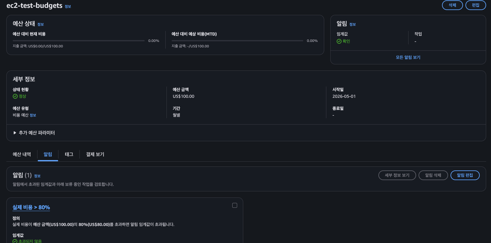
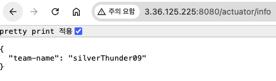
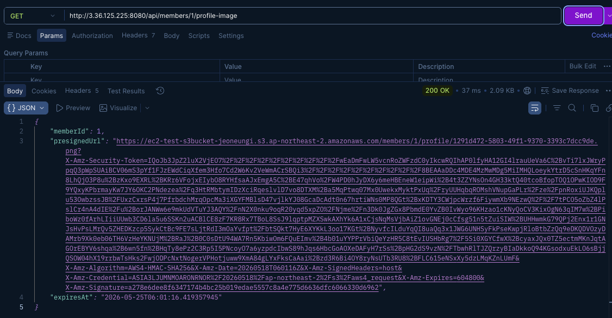
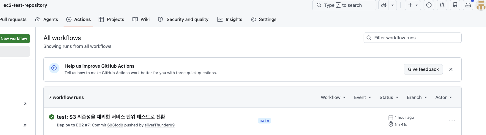
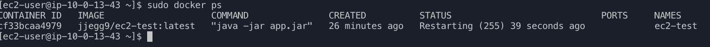
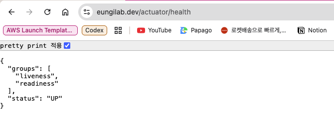
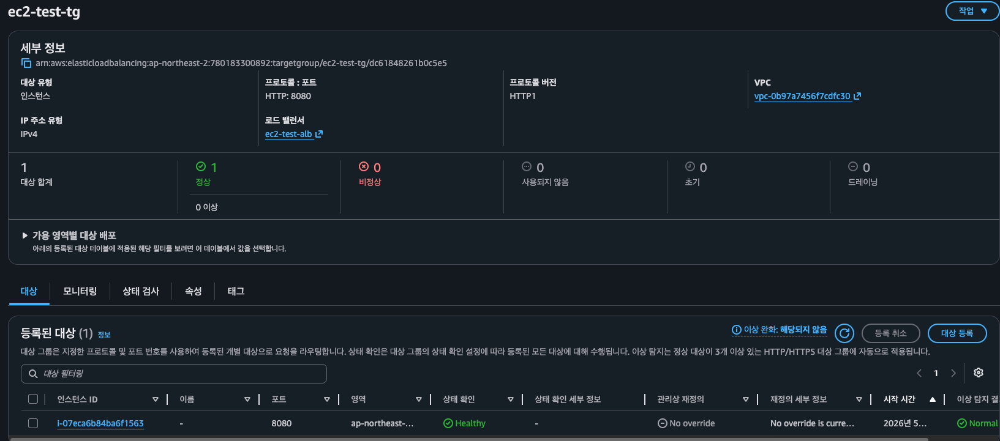

## AWS Budget 설정

## LV 1 - 네트워크 구축 및 핵심 기능 배포

>http://3.36.125.225:8080/actuator/health

## LV 2 - DB 분리 및 보안 연결하기

Actuator Info 엔드포인트 URL

JSON 출력 값

>http://3.36.125.225:8080/actuator/info

## LV 3 - 프로필 사진 기능 추가와 권한 관리

### 프로필 이미지 Presigned URL 검증

- Presigned URL 만료 시간: `2026-05-25T06:01:16.419357945`
- Presigned URL 유효기간: 7일 

### 접근 성공 스크린샷

## LV 4 - Docker & CI/CD 파이프라인 구축

### Github Actions 성공 이미지

### EC2 터미널 이미지

## LV 5 - 고가용성 아키텍처와 보안 도메인 연결 (ALB + ASG + HTTPS)

### HTTPS 적용된 도메인 URL

> https://eungilab/actuator/health

### Target Group(대상 그룹) 이미지

